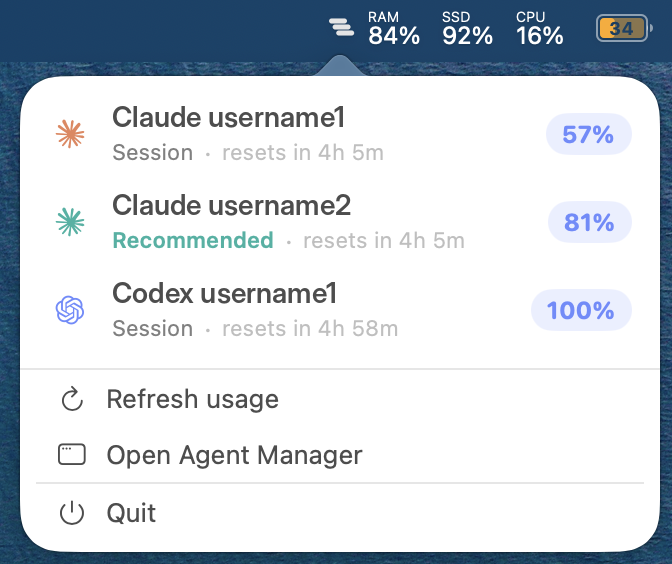
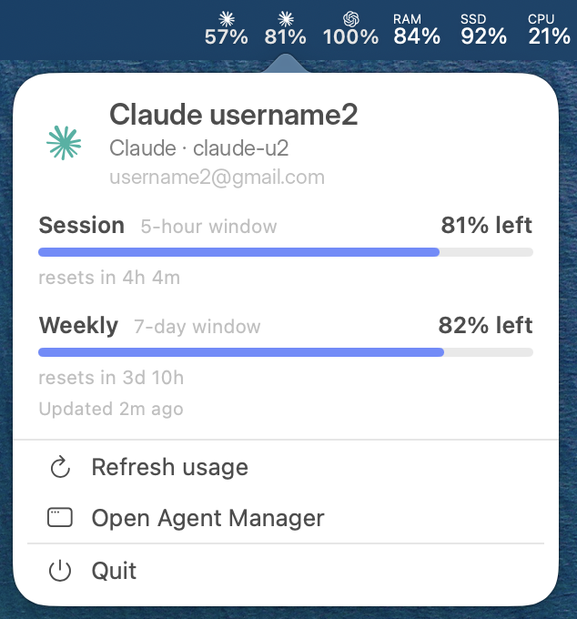

# Agent Manager

A macOS menu-bar app and CLI for juggling more than one paid **Claude Code** or
**Codex** account on the same machine.

If you have a couple of accounts, it lets you run them as separate logins, keep an
eye on how much usage each one has left, and optionally warm up an account's usage
window before you start work. Everything runs locally — no server, no telemetry.

> Agent Manager only touches accounts **you own and pay for**. It drives the
> official `claude` / `codex` CLIs and never proxies or stores your OAuth tokens —
> it only reads the credentials those tools already wrote.



## What it does

Three things:

### 1. Run any account from the terminal

```bash
am run <id> [-- <args forwarded to claude/codex>]
```

This starts a `claude` or `codex` session under that account's own isolated config
home and hands your terminal to the CLI. Your normal `~/.claude` / `~/.codex` login
is never touched.

Each account's home symlinks back to your real `~/.claude` / `~/.codex` for
everything except the per-account identity file, so accounts share the same
settings **and the same session history**. That means you can pick a session back
up under a different account — handy when one account's window runs out mid-task:

```bash
am run other-account -- --resume <session-id>
```

### 2. Track usage

The menu bar shows how much of each account's rolling 5-hour window is left;
clicking an account expands the weekly window and reset times.



The CLI shows the same:

```bash
am list                  # accounts + connection status
am usage                 # 5h + weekly capacity for connected accounts
am usage <id> --week     # one account, weekly window
```


### 3. Warm up a window before work

A subscription's 5-hour usage window starts on your first request, not at a fixed
time of day. Paint your working hours in the app, flip the **Scheduler active**
switch, and Agent Manager fires a small ping to open each account's window just
before you start — so you begin the day with a fresh window instead of starting
the clock the moment you sit down.


The pings come from one resident background agent (installed once — macOS shows
its "background items" notification a single time, ever). While the switch is
on, calendar repaints and account changes apply live; there's no re-apply step.

```bash
am ping <id>             # open <id>'s 5h window now (also what the scheduler runs)
```

Pings stay minimal — a couple around the edges of your day, not all night. A
ping the Mac slept through is skipped, not fired late.

**Lid closed?** Optionally flip **Wake Mac for pings** in Preferences: a tiny root helper
(approved once in System Settings → Login Items) arms a hardware wake ~45
seconds before each ping, the ping runs, and the Mac goes back to sleep if
nobody's around. Firmware rule: a closed lid only wakes on AC power.

**Lid closed *on battery*?** That's the one case no software can wake, so the
experimental **Cloud fallback** (Preferences, Claude accounts only) covers it
from the other side: it keeps a tiny one-shot routine — "AgentManager Routine",
visible at claude.ai/code/routines — armed 5 minutes after each scheduled ping.
A ping that runs locally re-arms the routine forward, so it never fires; a ping
the sleeping Mac misses lets Anthropic's cloud run it instead (one minimal
Haiku turn that opens the window), and the redundant local ping is skipped on
wake. Off by default; when it's off (or anything errors), scheduling behaves
exactly as before.

## CLI reference

```
am run <id> [-- <args>]   launch a session as <id>; args after `--` go to claude/codex
am list                   list accounts with status + provider
am usage [<id>]           capacity for connected accounts (--week, --provider, --sort, --no-color)
am ping <id>              fire one ping now — opens <id>'s 5h window
am scheduler status       the background scheduler's heartbeat and next fires
```

Adding and connecting accounts, and painting your work hours, happen in the app
(the **Agents**, **Planner**, and **Monitoring** screens). The CLI handles the
day-to-day.

## How it works

- **Isolated homes.** Each account is its own `CLAUDE_CONFIG_DIR` / `CODEX_HOME`
  under the app's folder. Only the identity file (`.claude.json` / `auth.json`) is
  real and per-account; the rest is symlinked from your real config, so accounts
  share settings and history without stepping on each other's login.
- **Official CLI only.** Logins, pings, and launches all run the real `claude` /
  `codex` binary. Agent Manager only reads the credentials those tools write — it
  never relays or stores a token.
- **Local only.** Network calls go only to the official provider endpoints
  (`api.anthropic.com`, `chatgpt.com`): the usage reads the real CLI already
  makes, plus — only if you turn the experimental cloud fallback on — managing
  the anchor routine in your own claude.ai account. No backend, no analytics.
- **One quiet background agent.** Scheduled pings come from a single resident
  launchd agent with an in-process queue — flipping the scheduler on and off
  never churns launchd (and never re-triggers macOS's background-items
  notifications). The optional wake helper is the one privileged piece: ~200
  lines that only read two workspace files and arm wake timers — it links none
  of the account/keychain/network code.
- **Inspectable.** Reads, pings, launches, and HTTP calls go to local log files you
  can read, with auth headers redacted.

## Requirements

- macOS 14 (Sonoma) or later
- The `claude` and/or `codex` CLI, installed and logged in at least once
- Swift 6 toolchain (Xcode 16+) to build from source

## Build & run

```bash
git clone <your-fork-url> agent-manager
cd agent-manager

swift build            # library, CLI, and app
swift test             # test suite
.build/debug/am help   # the CLI

# `make build` assembles and codesigns .build/AgentManager.app (the bundle is
# what makes the wake helper's System Settings approval flow possible), and
# `make run` opens it. Signing uses a local dev identity so Keychain grants
# survive rebuilds: create a self-signed "AgentManager Dev" certificate in
# Keychain Access first (or pass CODESIGN_ID="Developer ID Application: …").
make run
```

## Where your data lives

Everything is under `~/Library/Application Support/AgentManager/`:

| File | Contents |
| --- | --- |
| `accounts.json` | account metadata (label, color, email, keychain service name) — no secrets |
| `schedule.json` | your work hours and window length |
| `scheduler.json` / `scheduler-status.json` | the scheduler switch + the background agent's heartbeat and upcoming pings |
| `wake.json` | the "Wake Mac for pings" opt-in |
| `cloud-fallback.json` / `cloud-fallback-state.json` | the cloud-fallback opt-in + which claude.ai routine is armed per account |
| `usage.json` | last-known usage reading per account |
| `preferences.json` | display preferences (e.g. clock style) |
| `audit.log.jsonl` / `activity.jsonl` / `network.jsonl` | local logs (auth headers redacted) |
| `homes/<id>/` | per-account config home (created `0700`) |

Credentials are **not** in any of these. Claude's token stays in the macOS login
Keychain; Codex's stays in the per-account `auth.json` the official CLI wrote.

## Responsible use

This is a convenience tool for accounts you already pay for. It uses the official
CLI, keeps everything on your machine, and keeps scheduled pings minimal. Window
warming depends on provider behavior that could change at any time, so treat it as
a personal optimization, not a guarantee.

## Contributing

Architecture, commands, conventions, and the security rules the code assumes are in
**[AGENTS.md](AGENTS.md)**. The logic lives in `AgentManagerCore` (unit-tested);
the app and CLI are thin layers over it.

## License

[MIT](LICENSE) © 2026 Marin Sokol
