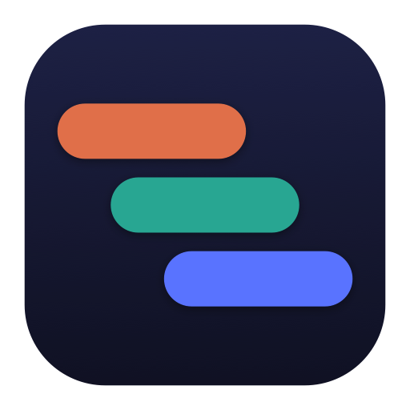
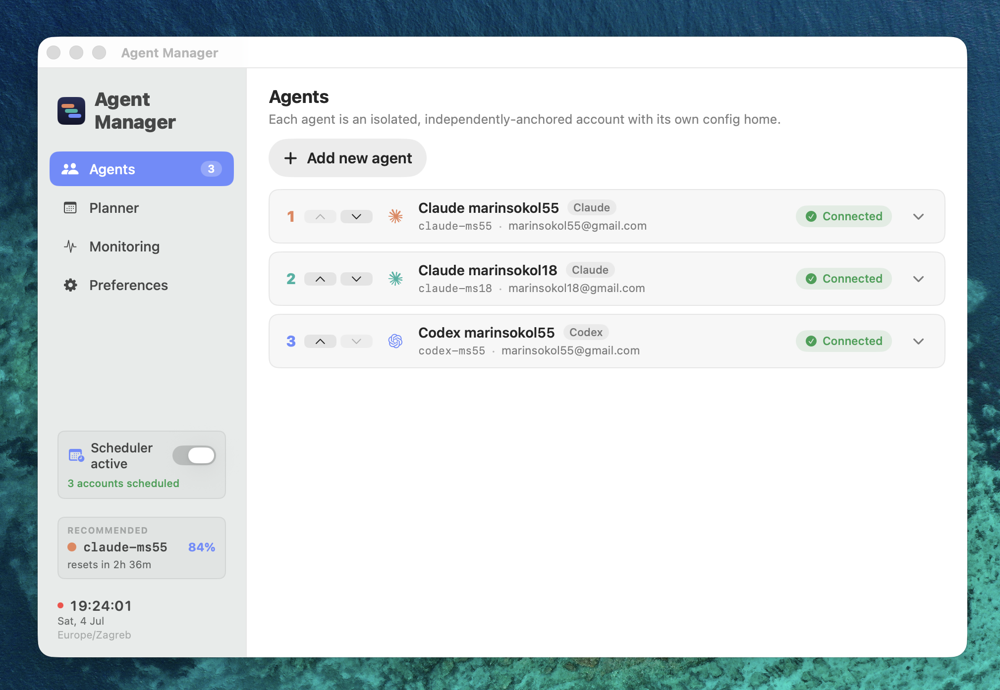
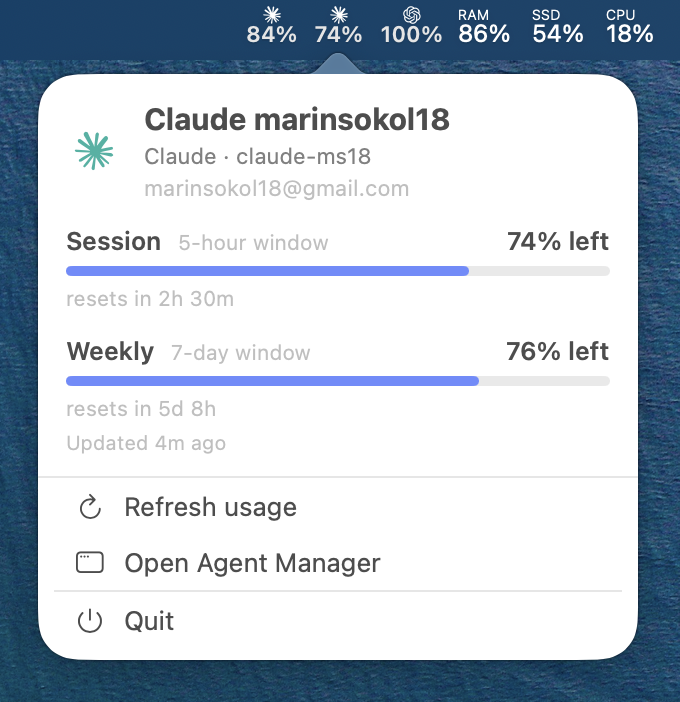
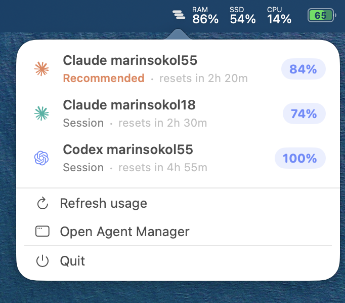
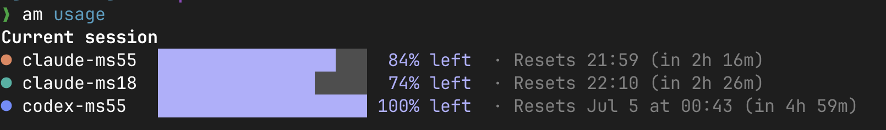
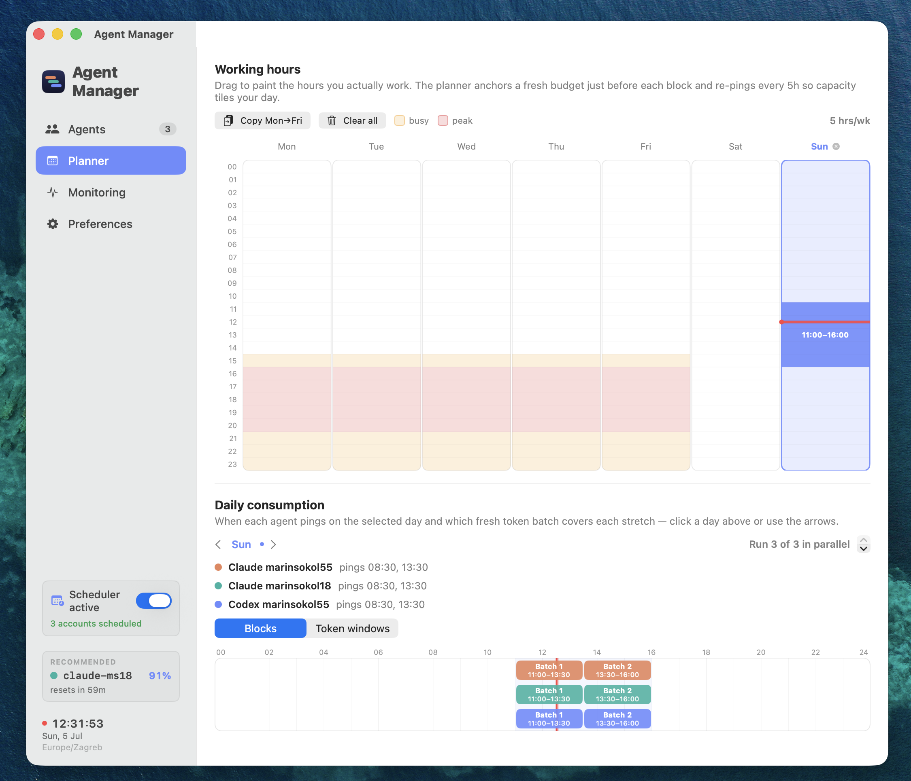

<h1>
  
  Agent Manager
</h1>

A macOS app for juggling multiple Claude Code and Codex accounts on the same machine.

It lets you run each account as a separate agent session, keep an
eye on how much usage each one has left, and warm up an account's usage
window to increase the number of tokens available.


## What

### 1. Run any account independently



```bash
am run <id> [<args forwarded to claude/codex>]
```

This starts a `claude` or `codex` session under that account's own isolated config
home and hands your terminal to the CLI. Your normal `~/.claude` / `~/.codex` login is never touched.

Each account's home symlinks back to your real `~/.claude` / `~/.codex` for
everything except the per-account identity file (`.claude.json` and `auth.json`), so accounts share the same
settings **and the same session history**. That means you can pick a session back
up under a different account — handy when one account's window runs out mid-task:

```bash
am run claude-ms55
# runs out of tokens
am run claude-ms18 --resume <session-id>
```

The **Source home** effectively groups accounts: everything pointing at the
same folder shares settings and history, so you can run a few work accounts
off one source home and your personal ones off another, fully apart.

### 2. Track usage at a glance

Track each account's usage from the menu bar (
individual menu bar entries or one collapsed) or from the CLI (`am usage`).

<table align="center">
  <tr>
    <th>Menu bar — individual</th>
    <th>Menu bar — merged</th>
  </tr>
  <tr valign="top">
    <td></td>
    <td></td>
  </tr>
  <tr>
    <th colspan="2">CLI — <code>am usage</code></th>
  </tr>
  <tr>
    <td colspan="2"></td>
  </tr>
</table>

### 3. Warm up token windows

Instead of starting your subscription's 5-hour usage window on your first request, start it at a fixed time beforehand, to maximize the number of tokens available when working.

Paint your working hours in the app, flip the **Scheduler active**
switch, and Agent Manager fires a small ping to open each account's window just
before you start, so that you begin the day with a fresh window instead of starting
the clock the moment you sit down.



Each ping is a real interactive turn in the CLI over a managed terminal, not an SDK or programmatic call, to stay future-proof and not lose access
through policy changes like
[this one](https://support.claude.com/en/articles/15036540-use-the-claude-agent-sdk-with-your-claude-plan).

**Lid closed or Mac sleeping?** Flip **Wake Mac for pings** in Preferences: a tiny helper arms a hardware wake ~45
seconds before each ping, the ping runs, and the Mac goes back to sleep if
nobody's around.

**Lid closed *on battery*?** That's the one case no software can wake on Mac, so for Claude Code accounts we use Anthropic's cloud compute for routines to start the token window. Just flip the **Claude Routine fallback** toggle in Preferences. It keeps a tiny one-shot routine — "AgentManager Routine",
visible at claude.ai/code/routines — armed 5 minutes after each scheduled ping.
A ping that runs locally disarms the pending routine, so it never fires; but a ping
the sleeping Mac misses lets Anthropic's cloud run it instead.

## CLI reference

```
am list                   list accounts with status + provider
am run <id> [<args>]      launch a session as <id>; remaining args go to claude/codex
am usage [<id>]           capacity for connected accounts (--week, --provider, --sort)
```

Everything else is doable only in the app, the CLI handles only running-related actions.

## How it works

- **Isolated homes.** Each account is its own `CLAUDE_CONFIG_DIR` / `CODEX_HOME`
  under the app's folder. Only the identity file (`.claude.json` / `auth.json`) is
  real and per-account; the rest is symlinked from your real config, so accounts
  share settings and history without stepping on each other's login.
- **Official CLI only.** Logins, pings, and launches all run the real `claude` /
  `codex` binary. Agent Manager only reads the credentials those tools write — it
  never relays or stores a token.
- **Local only.** Network calls go only to the official provider endpoints
  (`api.anthropic.com`, `chatgpt.com`): the usage reads the real CLI already
  makes, plus — only if you turn the experimental Claude Routine fallback on — managing
  the anchor routine in your own claude.ai account. No backend, no analytics.
- **One quiet background agent.** Scheduled pings come from a single resident
  launchd agent with an in-process queue — flipping the scheduler on and off
  never churns launchd (and never re-triggers macOS's background-items
  notifications). The optional wake helper is the one privileged piece: ~200
  lines that only read two workspace files and arm wake timers — it links none
  of the account/keychain/network code.
- **Inspectable.** Reads, pings, launches, and HTTP calls go to local log files you
  can read, with auth headers redacted.

## Requirements

- macOS 14 (Sonoma) or later
- The `claude` and/or `codex` CLI, installed and logged in at least once

## Where your data lives

Everything is under `~/Library/Application Support/AgentManager/`:

| File | Contents |
| --- | --- |
| `accounts.json` | account metadata (label, color, email, keychain service name) — no secrets |
| `schedule.json` | your work hours and window length |
| `scheduler.json` / `scheduler-status.json` | the scheduler switch + the background agent's heartbeat and upcoming pings |
| `wake.json` | the "Wake Mac for pings" opt-in |
| `cloud-fallback.json` / `cloud-fallback-state.json` | the cloud-fallback opt-in + which claude.ai routine is armed per account |
| `usage.json` | last-known usage reading per account |
| `preferences.json` | display preferences (e.g. clock style) |
| `audit.log.jsonl` / `activity.jsonl` / `network.jsonl` | local logs (auth headers redacted) |
| `homes/<id>/` | per-account config home (created `0700`) |

Credentials are **not** in any of these. Claude's token stays in the macOS login
Keychain; Codex's stays in the per-account `auth.json` the official CLI wrote.

## Responsible use

This is a convenience tool for accounts you already pay for. It uses the official
CLI, keeps everything on your machine, and keeps scheduled pings minimal. Window
warming depends on provider behavior that could change at any time, so treat it as
a personal optimization, not a guarantee.

## Contributing

Architecture, commands, conventions, and the security rules the code assumes are in
**[AGENTS.md](AGENTS.md)**. The logic lives in `AgentManagerCore`;
the app and CLI are thin layers over it.

## License

[MIT](LICENSE) © 2026 Marin Sokol


_This is an independent project — not affiliated with by Anthropic or OpenAI. "Claude", "Claude Code", and "Codex" are
trademarks of their respective owners._
