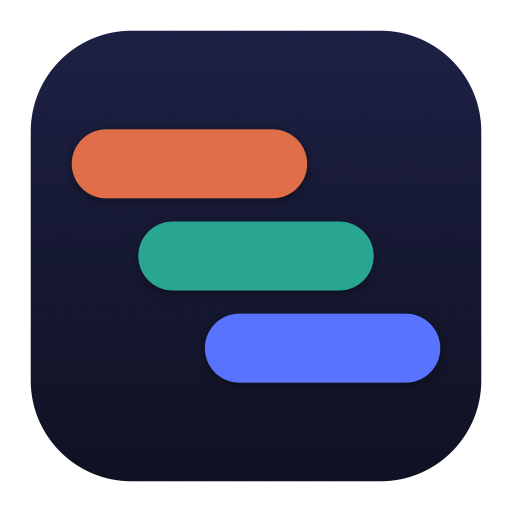
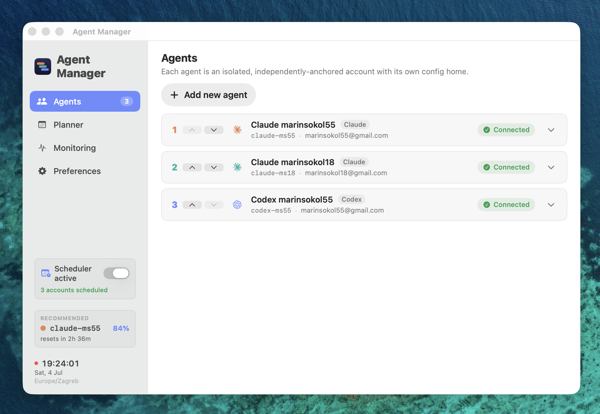
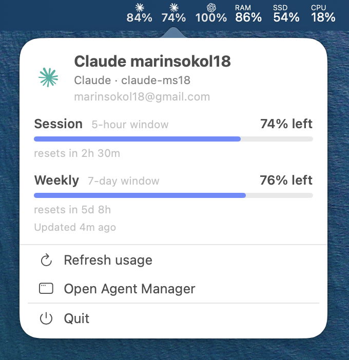
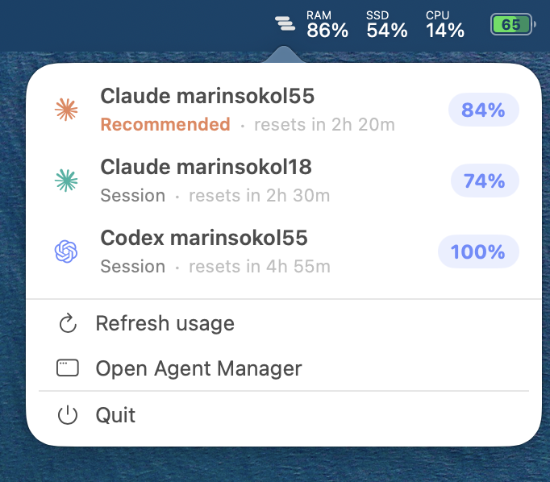
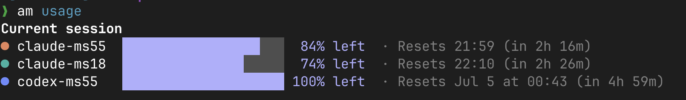
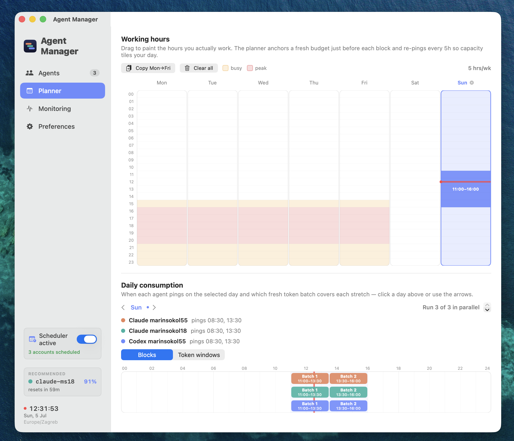

<h1>
  
  Agent Manager
</h1>

A macOS app for juggling multiple Claude Code and Codex accounts on the same machine.

It lets you run each account as a separate agent session, keep an
eye on how much usage each one has left, and warm up an account's usage
window to increase the number of tokens available.


## What

### 1. Run any account independently



```bash
am run <id> [<args forwarded to claude/codex>]
```

This starts a `claude` or `codex` session under that account's own isolated config
home and hands your terminal to the CLI. Your normal `~/.claude` / `~/.codex` login is never touched.

Each account's home symlinks back to your real `~/.claude` / `~/.codex` for
everything except the per-account identity file (`.claude.json` and `auth.json`), so accounts share the same
settings **and the same session history**. That means you can pick a session back
up under a different account — handy when one account's window runs out mid-task:

```bash
am run claude-ms55
# runs out of tokens
am run claude-ms18 --resume <session-id>
```

The **Source home** effectively groups accounts: everything pointing at the
same folder shares settings and history, so you can run a few work accounts
off one source home and your personal ones off another, fully apart.

### 2. Track usage at a glance

Track each account's usage from the menu bar (
individual menu bar entries or one collapsed) or from the CLI (`am usage`).

<table align="center">
  <tr>
    <th>Menu bar — individual</th>
    <th>Menu bar — merged</th>
  </tr>
  <tr valign="top">
    <td></td>
    <td></td>
  </tr>
  <tr>
    <th colspan="2">CLI — <code>am usage</code></th>
  </tr>
  <tr>
    <td colspan="2"></td>
  </tr>
</table>

### 3. Warm up token windows

Instead of starting your subscription's 5-hour usage window on your first request, start it at a fixed time beforehand, to maximize the number of tokens available when working.

Paint your working hours in the app, flip the **Scheduler active**
switch, and Agent Manager fires a small ping (programmatic by default; also sdk, controlled terminal, your own custom command, or Claude routine) to open each account's window just
before you start, so that you begin the day with a fresh window instead of starting
the clock the moment you sit down.
If you already run a daily job against Claude or Codex — an eval, say — pick
the **Custom command** ping method and point it at that executable: the job
itself becomes the anchoring turn, so the morning window is set up by real
work instead of a throwaway prompt. The command is stored as arguments, never
run through a shell (point it at a script, or at `/bin/zsh -lc '…'`, if you
want shell features). It runs from its own directory with stdin closed, may
take up to 8 minutes, and Agent Manager still checks usage afterwards to
decide whether the window actually anchored. A non-zero exit is reported but
not treated as a failed ping.

A *scheduled* run does not get your login shell's environment: it inherits
the scheduler's minimal launchd environment (no `~/.zshrc` exports, no
nvm/pyenv setup; `PATH` is just `~/.local/bin`, Homebrew, and the system
directories). The app's **Test ping** sees the app's environment, and only
`am ping --method custom` from Terminal sees your shell — so a job that passes
there can still fail at 6 am. Export what the job needs (dataset paths, tool
versions, `PATH` entries) inside the script itself, or deliberately point the
command at `/bin/zsh -lc '…'` to load your profile.
On top of that environment it can rely on:

| Variable | Value |
| --- | --- |
| `CLAUDE_CONFIG_DIR` / `CODEX_HOME` | the account's managed home, so `claude` / `codex` run as that account |
| `AGENT_MANAGER_ACCOUNT_ID` | the account id |
| `AGENT_MANAGER_PROVIDER` | `claude` or `codex` |
| `AGENT_MANAGER_CLAUDE_BIN` / `AGENT_MANAGER_CODEX_BIN` | the CLI binary Agent Manager would run; its directory is also first on `PATH` |

`ANTHROPIC_API_KEY` / `OPENAI_API_KEY` are removed, so the job bills the
subscription, not an API key.

The ping method is a default per provider, and any single account can
override it: in **Preferences → Ping method**, the menu lists *All Claude
accounts*, *All Codex accounts*, and each account under them. Pick an account
to give it its own method — say, your eval as a custom command on just the one
account it belongs to, while the rest keep the default — or pick *Same as all
… accounts* to make it follow the default again. An overridden account's
custom command is its own; it never falls back to the provider's. The
provider view names the accounts that override it, and `am list` marks them
with `[ping: <method>]`.

If you only want that automated morning window and would rather start later
ones yourself, tick **First ping only** above the day's ping list: each account
then keeps just its first ping of every workday.



## CLI reference

```
am list                   list accounts with status + provider
am run <id> [<args>]      launch a session as <id>; remaining args go to claude/codex
am usage [<id>]           capacity for connected accounts (--week, --provider, --sort)
```

Everything else is doable only in the app, the CLI handles only running-related actions.

## How it works

- **Isolated homes.** Each account is its own `CLAUDE_CONFIG_DIR` / `CODEX_HOME`
  under the app's folder. Only the identity file (`.claude.json` / `auth.json`) is
  real and per-account; the rest is symlinked from your real config, so accounts
  share settings and history without stepping on each other's login.
- **Official tooling only.** Logins and launches run the real `claude` / `codex`
  binary. Pings use those binaries directly or through their official SDKs —
  or, with the custom method, your own command under the account's home.
  Agent Manager only reads the credentials those tools write — it never relays
  or stores a token.
- **Local only.** Network calls go only to the official provider endpoints
  (`api.anthropic.com`, `chatgpt.com`): the usage reads the real CLI already
  makes, plus — only for accounts you set to Claude's cloud routine ping
  method — managing the anchor routine in your own claude.ai account. No backend, no analytics.
- **One quiet background agent.** Scheduled pings come from a single resident
  launchd agent with an in-process queue — flipping the scheduler on and off
  never churns launchd (and never re-triggers macOS's background-items
  notifications). The optional wake helper is the one privileged piece: ~200
  lines that only read two workspace files and arm wake timers — it links none
  of the account/keychain/network code.
- **Inspectable.** Reads, pings, launches, and HTTP calls go to local log files you
  can read, with auth headers redacted.

## Requirements

- macOS 14 (Sonoma) or later
- The `claude` and/or `codex` CLI, installed and logged in at least once

## Where your data lives

Everything is under `~/Library/Application Support/AgentManager/`:

| File | Contents |
| --- | --- |
| `accounts.json` | account metadata (label, color, email, keychain service name) — no secrets |
| `schedule.json` | your work hours, window length, and planner options |
| `scheduler.json` / `scheduler-status.json` | the scheduler switch + the background agent's heartbeat and upcoming pings |
| `wake.json` | the "Wake Mac for pings" opt-in |
| `cloud-fallback-state.json` | which claude.ai routine is armed per account, and for when |
| `usage.json` | last-known usage reading per account |
| `preferences.json` | display preferences plus separate Claude/Codex ping methods, any per-account overrides (and the custom commands, if you set them) |
| `sdk-ping/` | SDK helper scripts plus the SDK dependencies you install — `node_modules/` for Claude, `.venv/` for Codex (only when SDK pings are used) |
| `audit.log.jsonl` / `activity.jsonl` / `network.jsonl` | local logs (auth headers redacted) |
| `homes/<id>/` | per-account config home (created `0700`) |

Credentials are **not** in any of these. Claude's token stays in the macOS login
Keychain; Codex's stays in the per-account `auth.json` the official CLI wrote.

## Responsible use

This is a convenience tool for accounts you already pay for. It uses the official
CLI, keeps everything on your machine, and keeps scheduled pings minimal. Window
warming depends on provider behavior that could change at any time, so treat it as
a personal optimization, not a guarantee.

## Contributing

Architecture, commands, conventions, and the security rules the code assumes are in
**[AGENTS.md](AGENTS.md)**. The logic lives in `AgentManagerCore`;
the app and CLI are thin layers over it.

## License

[MIT](LICENSE) © 2026 Marin Sokol


_This is an independent project — not affiliated with by Anthropic or OpenAI. "Claude", "Claude Code", and "Codex" are
trademarks of their respective owners._
